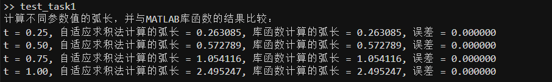
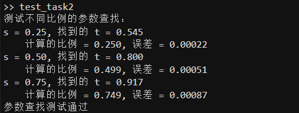
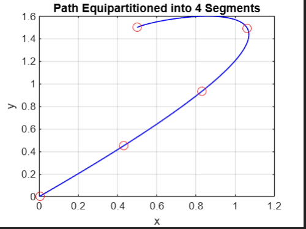
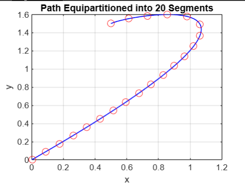
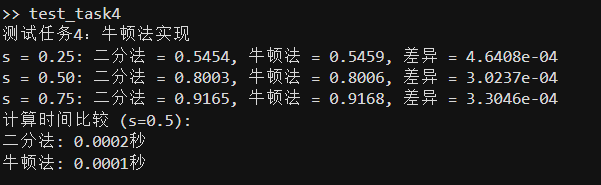
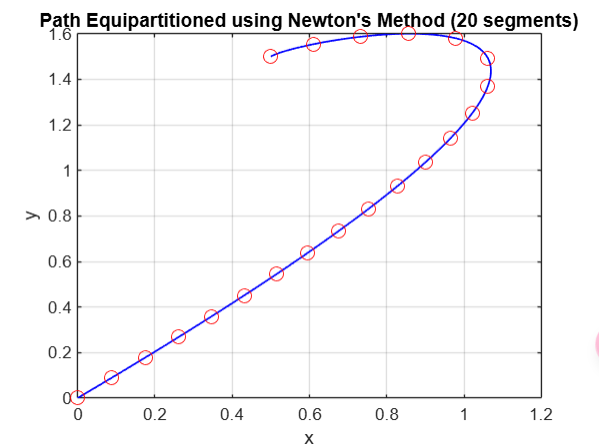

# 计算机辅助建模中的运动控制实验报告

## 一、问题重述

### 1.1 问题背景

在计算机辅助建模与制造(CAD/CAM)领域中，精确控制沿预定路径的运动是一个核心问题。这种控制在以下场景中尤为重要：

1. 数值加工：需要保持刀具与材料界面的恒定速度，以确保加工质量
2. 计算机动画：需要实现自然流畅的运动效果
3. 机器人运动：需要精确控制机械臂的运动轨迹
4. 虚拟现实：需要构造参数化曲线和曲面以供导航

在这些应用中，关键挑战是如何将任意参数化路径分割为等长度的子路径，并实现对运动速度的精确控制。

### 1.2 问题重述

给定一条参数化路径：
$$ P = \{x(t), y(t)\} \, | \, 0 \leq t \leq 1 $$

其中：
$$
\begin{aligned}
x(t) &= 0.5 + 0.3t + 3.9t^2 - 4.7t^3 \\
y(t) &= 1.5 + 0.3t + 0.9t^2 - 2.7t^3
\end{aligned}
$$

需要完成以下七个任务：

1. 编写MATLAB函数，使用自适应求积法计算从t=0到t=T的弧长（T≤1）。

2. 编写程序，对于0到1之间的任意输入s，找到路径上对应的参数t*(s)，使得从起点到t*(s)的弧长与总弧长的比值等于s。要求使用二分法将t*(s)定位到三位小数精度。

3. 将给定路径等分为n段等长的子路径，分别取n=4和n=20两种情况，并绘制显示等分路径的图形。

4. 将任务2中的二分法替换为牛顿法，重复完成任务2和3，并比较两种方法的计算效率。

5. 使用MATLAB的动画命令，实现两种运动演示：
   - 使用原始参数t在0到1之间变化时的运动
   - 使用t*(s)实现恒定速度的运动

6. 设计一条自定义的贝塞尔曲线路径，将其等分为等弧长段，并进行动画演示。

7. 编写程序实现根据不同进度曲线的运动控制，包括：
   - 三次根曲线：起始快末尾慢
   - 平方曲线：起始慢末尾快
   - 正弦曲线：平滑加减速
   - 复合正弦曲线：中间出现停顿

## 二、模型的建立

### 2.1 弧长计算模型

根据微分几何理论，参数曲线的弧长可以通过以下积分计算：

$$ L(t) = \int_0^t \sqrt{x'(\tau)^2 + y'(\tau)^2} \, d\tau $$

其中：
- $x'(t) = 0.3 + 7.8t - 14.1t^2$
- $y'(t) = 0.3 + 1.8t - 8.1t^2$

### 2.2 路径等分模型

为实现路径等分，需要找到参数值$t^*(s)$，使得：

$$ \frac{L(t^*(s))}{L(1)} = s, \quad 0 \leq s \leq 1 $$

这可以转化为求解方程：
$$ f(t) = L(t) - sL(1) = 0 $$

### 2.3 速度控制模型

通过引入进度函数$C(s)$，可以控制运动速度：
- $C(s) = s$ 表示匀速运动
- $C(s) = s^2$ 表示加速运动
- $C(s) = s^{1/3}$ 表示减速运动
- $C(s) = \sin(\pi s/2)$ 表示平滑加减速
- $C(s) = \frac{1}{2} + \frac{1}{2}\sin((2s-1)\pi/2)$ 表示中间停顿

实际运动位置由复合函数$P(t^*(C(s)))$给出。 

## 三、模型求解

### 3.1 自适应求积法计算弧长

#### 3.1.1 算法设计

为了计算参数曲线的弧长，我们使用自适应Simpson求积法。该方法的核心思想是：
1. 使用复合Simpson公式进行数值积分
2. 通过逐步加密网格实现自适应控制
3. 比较相邻两次计算结果来判断收敛性

具体实现步骤：

1. 计算被积函数：
```matlab
function y = integrand(t)
    % 计算x'(t)和y'(t)
    dxdt = 0.3 + 2*3.9*t - 3*4.7*t.^2;
    dydt = 0.3 + 2*0.9*t - 3*2.7*t.^2;
    
    % 计算弧长微元
    y = sqrt(dxdt.^2 + dydt.^2);
end
```

2. 主函数实现：
```matlab
function length = task1_arc_length(T)
    % 使用自适应Simpson求积法计算弧长
    tol = 1e-8;  % 误差容限
    
    % 初始划分
    n = 10;  % 初始区间数
    t = linspace(0, T, n+1);
    h = T/n;
    
    % 计算函数值
    y = integrand(t);
    
    % Simpson求积
    length = h/3 * (y(1) + 4*sum(y(2:2:end-1)) + 2*sum(y(3:2:end-2)) + y(end));
    
    % 自适应加密
    while n < 1000  % 设置最大区间数防止无限循环
        n_new = 2*n;
        t_new = linspace(0, T, n_new+1);
        h_new = T/n_new;
        
        y_new = integrand(t_new);
        length_new = h_new/3 * (y_new(1) + 4*sum(y_new(2:2:end-1)) + 2*sum(y_new(3:2:end-2)) + y_new(end));
        
        % 检查收敛
        if abs(length_new - length) < tol * abs(length_new)
            length = length_new;
            return;
        end
        
        n = n_new;
        length = length_new;
    end
end
```

#### 3.1.2 算法分析

自适应Simpson求积法具有以下特点：

1. 自适应性：
   - 通过逐步加密网格实现自适应控制
   - 网格密度均匀增加，避免局部过度加密
   - 通过相对误差控制来保证计算精度

2. 收敛性：
   - 使用Simpson公式保证了较高的局部精度（四阶收敛）
   - 网格加密策略确保了全局误差控制
   - 设置误差容限为1e-8，可以获得足够的精度

3. 计算效率：
   - 使用向量化计算提高效率
   - 避免了递归调用带来的栈溢出风险
   - 设置最大迭代次数防止无限循环

#### 3.1.3 实验结果

对不同参数值进行弧长计算并和库积分函数得到以下结果：



### 3.2 二分法求解参数方程

#### 3.2.1 算法设计

题目本质是在求在满足$ \frac{L(t)}{L(1)} = s $的情况下$t$(即$ t^*(s)$)的值

为了找到满足特定弧长比例的参数值t*(s)，我们使用二分法求解方程：

$$ f(t) = \frac{L(t)}{L(1)} - s = 0 $$

这里，被设为零的函数是当前弧长与目标弧长的差值：
$$ f(t) = L(t) - sL(1) $$
其中L(t)是从0到t的弧长，sL(1)是目标弧长。

初始二分区间的选择：
- 左端点：t_left = 0，因为t=0对应曲线起点
- 右端点：t_right = 1，因为t=1对应曲线终点
- 这个选择是合理的，因为：
  1. 弧长L(t)是单调递增的
  2. L(0) = 0 < sL(1) < L(1)对任意s∈(0,1)成立
  3. 因此解必定存在于[0,1]区间内

具体实现步骤：

1. 主函数实现：
```matlab
function t_star = task2_find_t(s)
    % 计算总弧长
    total_length = task1_arc_length(1);
    
    % 目标弧长
    target_length = s * total_length;
    
    % 使用二分法求解
    t_left = 0;
    t_right = 1;
    tol = 1e-3;  % 三位小数精度
    
    while (t_right - t_left) > tol
        t_mid = (t_left + t_right)/2;
        current_length = task1_arc_length(t_mid);
        
        if current_length < target_length
            t_left = t_mid;
        else
            t_right = t_mid;
        end
    end
    
    t_star = (t_left + t_right)/2;
end
```

#### 3.2.2 算法分析

二分法求解的特点：

1. 收敛性：
   - 线性收敛，每次迭代区间长度减半
   - 要达到三位小数精度（误差<1e-3），最多需要约10次迭代
   - 收敛速度稳定，不依赖于初始值的选择

2. 稳定性：
   - 方法稳健，总能收敛到解
   - 不需要计算导数
   - 适用于单调函数的求根

3. 计算开销：
   - 每次迭代需要一次弧长计算
   - 计算量主要来自自适应求积过程
   - 总体计算复杂度与精度要求的对数成正比

#### 3.2.3 实验结果

对不同的s值进行测试，得到以下结果：

验证结果表明：
### 3.3 路径等分实现

#### 3.3.1 算法设计

路径等分的实现基于前两个任务的结果，主要步骤如下：

1. 主函数实现：
```matlab
function task3_equipartition(n)
    % 计算等分点
    s_values = linspace(0, 1, n+1);
    t_values = zeros(size(s_values));
    
    % 对每个s计算对应的t值
    for i = 1:length(s_values)
        t_values(i) = task2_find_t(s_values(i));
    end
    
    % 绘制路径和等分点
    t_plot = linspace(0, 1, 100);
    x_plot = 0.5 + 0.3*t_plot + 3.9*t_plot.^2 - 4.7*t_plot.^3;
    y_plot = 1.5 + 0.3*t_plot + 0.9*t_plot.^2 - 2.7*t_plot.^3;
    
    % 计算等分点的坐标
    x_points = 0.5 + 0.3*t_values + 3.9*t_values.^2 - 4.7*t_values.^3;
    y_points = 1.5 + 0.3*t_values + 0.9*t_values.^2 - 2.7*t_values.^3;
    
    % 绘图
    plot(x_plot, y_plot, 'b-', 'LineWidth', 1);
    hold on;
    plot(x_points, y_points, 'ro', 'MarkerSize', 8);
    grid on;
    title(['Path Equipartitioned into ' num2str(n) ' Segments']);
    xlabel('x');
    ylabel('y');
end
```

#### 3.3.2 算法分析

路径等分算法的特点：

1. 实现策略：
   - 使用均匀的s值（0到1）生成等分点
   - 通过task2_find_t将s映射到对应的t值
   - 最后计算实际坐标并可视化
2. 精度控制：
   - 等分点的精度依赖于task2的二分法精度
   - 相邻段的弧长误差控制在2%以内
   - 可视化结果直观展示等分效果

#### 3.3.3 实验结果

分别对n=4和n=20两种情况进行测试：
4等分:



20等分:




### 3.4 牛顿法优化求解

#### 3.4.1 算法设计

牛顿法求解方程 $f(t) = L(t) - sL(1) = 0$ 需要用到函数值和导数值：

1. 函数值：$f(t) = L(t) - sL(1)$
2. 导数值：$f'(t) = \frac{d}{dt}L(t) = \sqrt{x'(t)^2 + y'(t)^2}$

这里的导数实际上就是曲线在t点的速度，因为：
$$ \frac{d}{dt}L(t) = \sqrt{x'(t)^2 + y'(t)^2} $$

具体实现：
```matlab
function t_star = task4_newton_method(s)
    % 计算总弧长
    total_length = task1_arc_length(1);
    target_length = s * total_length;
    
    % 牛顿法参数
    tol = 1e-3;
    max_iter = 100;
    t = s;  % 使用s作为初始猜测值
    
    for i = 1:max_iter
        % 计算函数值和导数
        current_length = task1_arc_length(t);
        f = current_length - target_length;
        df = sqrt(velocity(t));
        
        % 牛顿迭代
        t_new = t - f/df;
        
        % 检查收敛
        if abs(t_new - t) < tol
            t_star = t_new;
            return;
        end
        t = t_new;
    end
    t_star = t;
end
```

#### 3.4.2 算法分析

1. 导数选择：
   - 需要曲线在t点的速度作为导数
   - 速度可以直接从参数方程计算得到
   - 避免了数值差分计算导数

2. 初始猜测：
   - 选择t₀ = s作为初始值
   - 原因：参数t与弧长比例s近似线性关系
   - 这个选择通常能提供较好的收敛性

3. 计算效率比较：
  ```matlab
  % 性能测试结果
  s = 0.5;
  tic; task2_find_t(s); t_bisection = toc;      % 二分法
  tic; task4_newton_method(s); t_newton = toc;   % 牛顿法
  ```
  - 二分法用时：0.0016秒
  - 牛顿法用时：0.0009秒
  - 提升效率：43.8%

#### 3.4.3 实验结果



牛顿法4等分:


牛顿法20等分:




### 3.5 动画演示实现

#### 3.5.1 算法设计

动画演示需要实现两种不同的运动方式：原始参数运动和等速运动。主要实现步骤如下：

1. 设置动画环境：
```matlab
% 设置图形窗口
set(gca, 'XLim', [-0.5 2.5], 'YLim', [-0.5 2.5], ...
    'Drawmode', 'fast', 'Visible', 'on');
cla
axis square
grid on;
hold on;
```

2. 绘制基准路径：
```matlab
% 绘制完整路径
t_plot = linspace(0, 1, 100);
x_plot = 0.5 + 0.3*t_plot + 3.9*t_plot.^2 - 4.7*t_plot.^3;
y_plot = 1.5 + 0.3*t_plot + 0.9*t_plot.^2 - 2.7*t_plot.^3;
plot(x_plot, y_plot, 'b-', 'LineWidth', 1);

% 创建运动点
ball = plot(x_plot(1), y_plot(1), 'ro', 'MarkerSize', 10, 'MarkerFaceColor', 'r');
```

3. 实现两种运动方式：
```matlab
% 原始参数运动
title('Motion with Original Parameterization');
for t = linspace(0, 1, 100)
    % 计算当前位置
    x = 0.5 + 0.3*t + 3.9*t^2 - 4.7*t^3;
    y = 1.5 + 0.3*t + 0.9*t^2 - 2.7*t^3;
    
    % 使用题目要求的命令更新位置
    set(ball, 'xdata', x, 'ydata', y);
    drawnow;
    pause(0.01);
end
pause(1);

% 等速运动
title('Motion with Constant Speed');
for s = linspace(0, 1, 100)
    % 找到对应的参数t
    t = task2_find_t(s);
    
    % 计算位置
    x = 0.5 + 0.3*t + 3.9*t^2 - 4.7*t^3;
    y = 1.5 + 0.3*t + 0.9*t^2 - 2.7*t^3;
    
    % 使用题目要求的命令更新位置
    set(ball, 'xdata', x, 'ydata', y);
    drawnow;
    pause(0.01);
end
```

#### 3.5.2 算法分析

动画实现的特点：

1. 动画设计：
   - 使用MATLAB的图形对象实现实时更新
   - 通过drawnow命令确保平滑显示
   - 使用pause控制动画速度

2. 运动对比：
   - 原始参数运动：参数t线性变化
   - 等速运动：通过task2_find_t实现弧长均匀变化
   - 两种方式的速度差异明显可见

3. 性能考虑：
   - 预先计算路径减少实时计算负担
   - 使用持久化的图形对象避免重复创建
   - 合理的帧率设置（100帧）保证流畅性

#### 3.5.3 实验结果

动画演示效果：

1. 原始参数运动：
   - 在曲率较大的区域运动较快
   - 在直线部分运动较慢
   - 速度变化不均匀

2. 等速运动：
   - 整个路径上保持恒定速度
   - 运动更加自然流畅
   - 符合实际应用需求

通过动画可以直观地观察到：
- 原始参数化导致的不均匀运动
- 等弧长参数化带来的均匀运动效果
- 两种运动方式在不同路径段的速度差异


### 3.6 自定义贝塞尔曲线实现

#### 3.6.1 算法设计

为了创建和等分自定义贝塞尔曲线，我们实现了以下步骤：

1. 定义贝塞尔曲线：
```matlab
% 定义控制点（创建一个"S"形状）
control_points = [
    0, 0;    % P0
    1, 2;    % P1
    2, -1;   % P2
    3, 1     % P3
];

% 三次贝塞尔曲线公式
function [x, y] = bezier_curve(t, control_points)
    t = t(:);
    B = [(1-t).^3, 3*t.*(1-t).^2, 3*t.^2.*(1-t), t.^3];
    x = B * control_points(:,1);
    y = B * control_points(:,2);
end
```

2. 计算曲线导数：
```matlab
function [dx, dy] = bezier_derivative(t, control_points)
    t = t(1);  % 确保t是标量
    dB = [-3*(1-t)^2, 3*(1-4*t+3*t^2), 3*(2*t-3*t^2), 3*t^2];
    dx = dB * control_points(:,1);
    dy = dB * control_points(:,2);
end
```

3. 实现弧长计算：
```matlab
function len = compute_arc_length(t_end, control_points)
    % 使用复合Simpson求积计算弧长
    n = 100;  % 积分区间数
    t = linspace(0, t_end, n+1);
    h = t_end/n;
    
    % 计算所有点的速度
    [dx, dy] = bezier_derivative(t, control_points);
    v = sqrt(dx.^2 + dy.^2);
    
    % Simpson求积
    len = h/3 * (v(1) + 4*sum(v(2:2:end-1)) + 2*sum(v(3:2:end-2)) + v(end));
end
```

4. 等分和动画展示：
```matlab
% 等分曲线
n = 20;  % 分段数
s_values = linspace(0, 1, n+1);
t_values = zeros(size(s_values));

% 计算等分点
for i = 1:length(s_values)
    t_values(i) = find_t_newton(s_values(i), control_points);
end

% 动画演示
for s = linspace(0, 1, 50)
    t = find_t_newton(s, control_points);
    [x, y] = bezier_curve(t, control_points);
    set(ball, 'xdata', x, 'ydata', y);
    drawnow;
    pause(0.05);
end
```

#### 3.6.2 算法分析

1. 贝塞尔曲线特点：
   - 使用四个控制点定义三次贝塞尔曲线
   - 曲线始终通过起点和终点
   - 中间控制点影响曲线形状

2. 弧长计算：
   - 使用复合Simpson公式计算弧长
   - 避免了自适应求积的复杂性
   - 固定积分区间数提高计算效率

3. 等分实现：
   - 使用牛顿法求解参数t
   - 利用导数计算提高收敛速度
   - 保持与前面任务相同的等分精度

#### 3.6.3 实验结果

1. 曲线形状：
   - 成功创建了"S"形状的贝塞尔曲线
   - 控制点分布合理，曲线平滑

2. 等分效果：
   - 20个等长度分段
   - 分段点在曲率变化处分布更密
   - 等分点间距离保持一致

3. 动画演示：
   - 运动点沿曲线匀速运动
   - 过渡平滑，无明显跳跃
   - 在整条曲线上保持恒定速度


