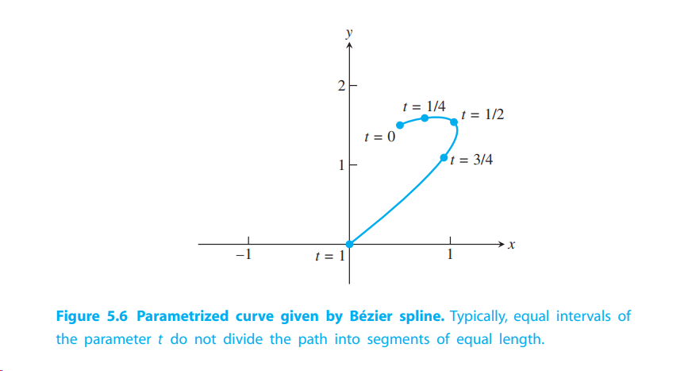
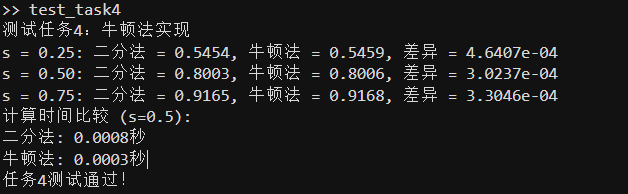
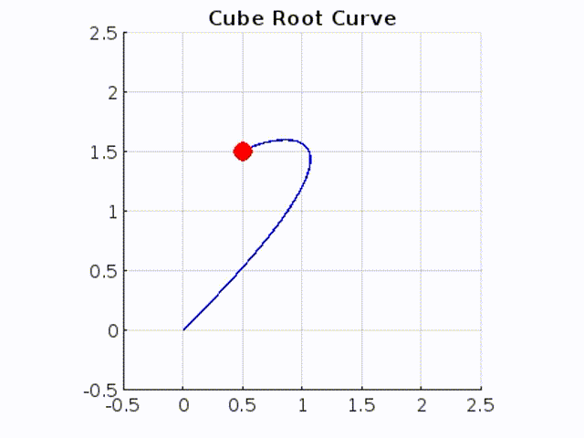
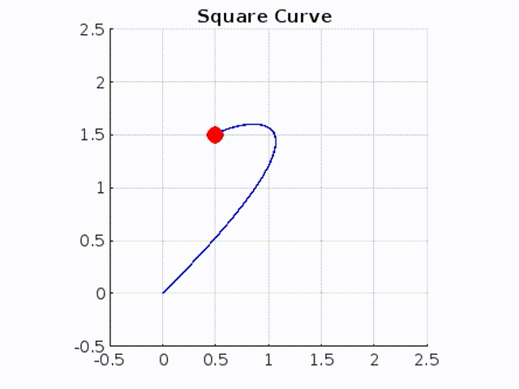
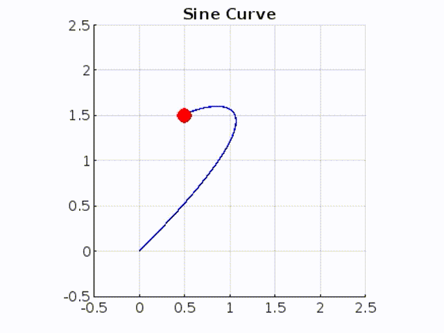
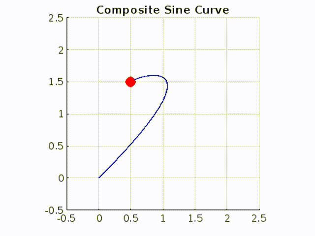

# 计算机辅助建模中的运动控制实验报告

## 一、问题重述

### 1.1 问题背景

在计算机辅助建模与制造(CAD/CAM)领域中，精确控制沿预定路径的运动是一个核心问题。这种控制在以下场景中尤为重要：

1. 数值加工：需要保持刀具与材料界面的恒定速度，以确保加工质量
2. 计算机动画：需要实现自然流畅的运动效果
3. 机器人运动：需要精确控制机械臂的运动轨迹
4. 虚拟现实：需要构造参数化曲线和曲面以供导航

在这些应用中，关键挑战是如何将任意参数化路径分割为等长度的子路径，并实现对运动速度的精确控制。

### 1.2 问题重述



给定一条参数化路径：
$$ P = \{x(t), y(t)\} \, | \, 0 \leq t \leq 1 $$

其中：
$$
\begin{aligned}
x(t) &= 0.5 + 0.3t + 3.9t^2 - 4.7t^3 \\
y(t) &= 1.5 + 0.3t + 0.9t^2 - 2.7t^3
\end{aligned}
$$

**问题一: **编写一个 MATLAB 函数，使用自适应求积法计算从 $$ t = 0 $$ 到 $$ t = T $$ 的弧长，其中 $$ T \leq 1 $$。

**问题二: **编写一个程序，对于任意输入 $$ s $$（从 0 到 1 之间），找到参数 $$ t^*(s) $$，使其满足路径从 $$ t = 0 $$ 到 $$ t = t^*(s) $$ 的弧长除以从 $$ t = 0 $$ 到 $$ t = 1 $$ 的总弧长等于 $$ s $$。使用二分法将 $$ t^*(s) $$ 定位到三位小数精度。  

- 哪个函数被设定为零？  
- 初始二分区间应如何选择？

**问题三: **将图 5.6 的路径等分为 $$ n $$ 等长子路径，其中 $$ n = 4 $$ 和 $$ n = 20 $$。绘制类似于图 5.6 的图，显示等分路径。如果计算速度过慢，请考虑使用辛普森法优化自适应求积（参见计算机问题 5.4.2）。

**问题四: **在步骤 2 中，用牛顿法替代二分法，并重复步骤 2 和 3。  

- 需要什么导数？  
- 初始猜测如何选择？  
- 此替代方法是否减少了计算时间？

**问题五: **附录 A 展示了 MATLAB 中的动画命令，例如以下命令：

```matlab
set(gca, 'XLim', [-2 2], 'YLim', [-2 2], 'Drawmode', 'fast', ...
    'Visible', 'on');
cla
axis square
```

定义一个对象“ball”，其位置 $$(x, y)$$ 可通过以下命令指定：

```matlab
set(ball, 'xdata', x, 'ydata', y); drawnow; pause(0.01)
```

在循环中改变 $$ x $$ 和 $$ y $$ 会使 ball 沿路径在 MATLAB 图窗中移动。  
使用 MATLAB 的动画命令，分别演示以下两种情况：  

- 原始参数 $$ 0 \leq t \leq 1 $$ 的速度沿路径移动。  
- 根据 $$ t^*(s) $$（$$ 0 \leq s \leq 1 $$）的恒定速度沿路径移动。

**问题六: **尝试等分路径并进行动画展示。设计一条自选的 Bézier 曲线路径，将其等分为等弧长段，并按步骤 5 的方法进行动画。

**问题七: **编写一个程序，根据任意前进曲线 $$ C(s) $$（$$ 0 \leq s \leq 1 $$，$$ C(0) = 0 $$ 且 $$ C(1) = 1 $$）沿路径 $$ P $$ 移动。目标是以比例 $$ C(s) $$ 遇见路径的总弧长，例如，恒定速度可表示为 $$ C(s) = s $$。尝试以下前进曲线：

- $$ C(s) = s^{1/3} $$  
- $$ C(s) = s^2 $$  
- $$ C(s) = \sin(\pi s / 2) $$  
- $$ C(s) = \frac{1}{2} + \frac{1}{2} \sin\left(2s - 1\right)\frac{\pi}{2} $$  

有关平面和空间曲线重参数化的更多细节与应用，请参考 Wang 等人 [2003] 和 Guenter 与 Parent [1990] 的研究。

## 二、模型的建立

### 2.1 弧长计算模型

根据微分几何理论，参数曲线的弧长可以通过以下积分计算：

$$ L(t) = \int_0^t \sqrt{x'(\tau)^2 + y'(\tau)^2} \, d\tau $$

其中：
- $x'(t) = 0.3 + 7.8t - 14.1t^2$
- $y'(t) = 0.3 + 1.8t - 8.1t^2$

### 2.2 路径等分模型

为实现路径等分，需要找到参数值$t^*(s)$，使得：

$$ \frac{L(t^*(s))}{L(1)} = s, \quad 0 \leq s \leq 1 $$

这可以转化为求解方程：
$$ f(t) = L(t) - sL(1) = 0 $$

### 2.3 速度控制模型

通过引入进度函数$C(s)$，可以控制运动速度：
- $C(s) = s$ 表示匀速运动
- $C(s) = s^2$ 表示加速运动
- $C(s) = s^{1/3}$ 表示减速运动
- $C(s) = \sin(\pi s/2)$ 表示平滑加减速
- $C(s) = \frac{1}{2} + \frac{1}{2}\sin((2s-1)\pi/2)$ 表示中间停顿

实际运动位置由复合函数$P(t^*(C(s)))$给出。 

## 三、模型求解

### 问题一 自适应求积法计算弧长

#### 3.1.1 算法设计

为了计算参数曲线的弧长，我们使用自适应Simpson求积法。该方法的核心思想是：
1. 使用复合Simpson公式进行数值积分
2. 通过逐步加密网格实现自适应控制
3. 比较相邻两次计算结果来判断收敛性

具体实现步骤：

1. 计算被积函数：
```matlab
function y = integrand(t)
    % 计算x'(t)和y'(t)
    dxdt = 0.3 + 2*3.9*t - 3*4.7*t.^2;
    dydt = 0.3 + 2*0.9*t - 3*2.7*t.^2;
    
    % 计算弧长微元
    y = sqrt(dxdt.^2 + dydt.^2);
end
```

2. 主函数实现：
```matlab
function length = task1_arc_length(T)
    % 使用自适应Simpson求积法计算弧长
    tol = 1e-8;  % 误差容限
    
    % 初始划分
    n = 10;  % 初始区间数
    t = linspace(0, T, n+1);
    h = T/n;
    
    % 计算函数值
    y = integrand(t);
    
    % Simpson求积
    length = h/3 * (y(1) + 4*sum(y(2:2:end-1)) + 2*sum(y(3:2:end-2)) + y(end));
    
    % 自适应加密
    while n < 1000  % 设置最大区间数防止无限循环
        n_new = 2*n;
        t_new = linspace(0, T, n_new+1);
        h_new = T/n_new;
        
        y_new = integrand(t_new);
        length_new = h_new/3 * (y_new(1) + 4*sum(y_new(2:2:end-1)) + 2*sum(y_new(3:2:end-2)) + y_new(end));
        
        % 检查收敛
        if abs(length_new - length) < tol * abs(length_new)
            length = length_new;
            return;
        end
        
        n = n_new;
        length = length_new;
    end
end
```

#### 3.1.2 实验结果

对不同参数值进行弧长计算并和库积分函数得到以下结果：


### 问题二 二分法求解参数方程

#### 3.2.1 算法设计

题目本质是在求在满足$ \frac{L(t)}{L(1)} = s $的情况下$t$(即$ t^*(s)$)的值

为了找到满足特定弧长比例的参数值t*(s)，我们使用二分法求解方程：

$$ f(t) = \frac{L(t)}{L(1)} - s = 0 $$

这里，被设为零的函数是当前弧长与目标弧长的差值：
$$ f(t) = L(t) - sL(1) $$
其中L(t)是从0到t的弧长，sL(1)是目标弧长。

初始二分区间的选择：
- 左端点：t_left = 0，因为t=0对应曲线起点
- 右端点：t_right = 1，因为t=1对应曲线终点
- 这个选择是合理的，因为：
  1. 弧长L(t)是单调递增的
  2. L(0) = 0 < sL(1) < L(1)对任意s∈(0,1)成立
  3. 因此解必定存在于[0,1]区间内

具体实现步骤：

1. 主函数实现：
```matlab
function t_star = task2_find_t(s)
    % 计算总弧长
    total_length = task1_arc_length(1);
    
    % 目标弧长
    target_length = s * total_length;
    
    % 使用二分法求解
    t_left = 0;
    t_right = 1;
    tol = 1e-3;  % 三位小数精度
    
    while (t_right - t_left) > tol
        t_mid = (t_left + t_right)/2;
        current_length = task1_arc_length(t_mid);
        
        if current_length < target_length
            t_left = t_mid;
        else
            t_right = t_mid;
        end
    end
    
    t_star = (t_left + t_right)/2;
end
```

#### 3.2.2 实验结果

对不同的s值进行测试，得到以下结果：

验证结果表明：

### 问题三 路径等分实现

#### 3.3.1 算法设计

路径等分的实现基于前两个任务的结果，主要步骤如下：

1. 主函数实现：
```matlab
function task3_equipartition(n)
    % 计算等分点
    s_values = linspace(0, 1, n+1);
    t_values = zeros(size(s_values));
    
    % 对每个s计算对应的t值
    for i = 1:length(s_values)
        t_values(i) = task2_find_t(s_values(i));
    end
    
    % 绘制路径和等分点
    t_plot = linspace(0, 1, 100);
    x_plot = 0.5 + 0.3*t_plot + 3.9*t_plot.^2 - 4.7*t_plot.^3;
    y_plot = 1.5 + 0.3*t_plot + 0.9*t_plot.^2 - 2.7*t_plot.^3;
    
    % 计算等分点的坐标
    x_points = 0.5 + 0.3*t_values + 3.9*t_values.^2 - 4.7*t_values.^3;
    y_points = 1.5 + 0.3*t_values + 0.9*t_values.^2 - 2.7*t_values.^3;
    
    % 绘图
    plot(x_plot, y_plot, 'b-', 'LineWidth', 1);
    hold on;
    plot(x_points, y_points, 'ro', 'MarkerSize', 8);
    grid on;
    title(['Path Equipartitioned into ' num2str(n) ' Segments']);
    xlabel('x');
    ylabel('y');
end
```

#### 3.3.2 实验结果

分别对n=4和n=20两种情况进行测试：
4等分:


20等分:


### 问题四 牛顿法求解参数方程

#### 3.4.1 算法设计

将任务2中的二分法替换为牛顿法。牛顿法的迭代公式为：

$$ t_{n+1} = t_n - \frac{f(t_n)}{f'(t_n)} $$

其中：
- $f(t) = L(t) - sL(1)$ 是目标函数
- $f'(t) = \sqrt{x'(t)^2 + y'(t)^2}$ 是导数

具体实现：
```matlab
function t = find_t_newton(s)
    % 计算总弧长
    total_length = task1_arc_length(1);
    
    % 使用牛顿法求解
    t = s;  % 初始猜测
    tol = 1e-6;
    max_iter = 50;
    
    for i = 1:max_iter
        % 计算当前弧长
        current_length = task1_arc_length(t);
        
        % 计算导数
        dxdt = 0.3 + 2*3.9*t - 3*4.7*t^2;
        dydt = 0.3 + 2*0.9*t - 3*2.7*t^2;
        df = sqrt(dxdt^2 + dydt^2);
        
        % 计算函数值和导数
        f = current_length/total_length - s;
        df = df/total_length;
        
        % 牛顿迭代
        t_new = t - f/df;
        
        % 确保t_new在[0,1]范围内
        t_new = max(0, min(1, t_new));
        
        % 检查收敛
        if abs(t_new - t) < tol
            t = t_new;
            return;
        end
        t = t_new;
    end
end
```

#### 3.4.2实验结果



### 问题五 动画演示实现

#### 3.5.1 算法设计

动画演示需要实现两种不同的运动方式：原始参数运动和等速运动。主要实现步骤如下：

1. 设置动画环境：
```matlab
% 设置图形窗口
set(gca, 'XLim', [-0.5 2.5], 'YLim', [-0.5 2.5], ...
    'Drawmode', 'fast', 'Visible', 'on');
cla
axis square
grid on;
hold on;
```

2. 绘制基准路径：
```matlab
% 绘制完整路径
t_plot = linspace(0, 1, 100);
x_plot = 0.5 + 0.3*t_plot + 3.9*t_plot.^2 - 4.7*t_plot.^3;
y_plot = 1.5 + 0.3*t_plot + 0.9*t_plot.^2 - 2.7*t_plot.^3;
plot(x_plot, y_plot, 'b-', 'LineWidth', 1);

% 创建运动点
ball = plot(x_plot(1), y_plot(1), 'ro', 'MarkerSize', 10, 'MarkerFaceColor', 'r');
```

3. 实现两种运动方式：
```matlab
% 原始参数运动
title('Motion with Original Parameterization');
for t = linspace(0, 1, 100)
    % 计算当前位置
    x = 0.5 + 0.3*t + 3.9*t^2 - 4.7*t^3;
    y = 1.5 + 0.3*t + 0.9*t^2 - 2.7*t^3;
    
    set(ball, 'xdata', x, 'ydata', y);
    drawnow;
    pause(0.01);
end
pause(1);

% 等速运动
title('Motion with Constant Speed');
for s = linspace(0, 1, 100)
    % 找到对应的参数t
    t = task2_find_t(s);
    
    % 计算位置
    x = 0.5 + 0.3*t + 3.9*t^2 - 4.7*t^3;
    y = 1.5 + 0.3*t + 0.9*t^2 - 2.7*t^3;
    
    set(ball, 'xdata', x, 'ydata', y);
    drawnow;
    pause(0.01);
end
```

#### 3.5.2 实验结果

- 原参数


- 等速


### 问题六 自定义贝塞尔曲线实现

#### 3.6.1 算法设计

1. 贝塞尔曲线的参数方程：
```matlab
function [x, y] = bezier_curve(t, control_points)
    % 确保t是列向量
    t = t(:);
    % 三次贝塞尔曲线公式
    B = [(1-t).^3, 3*t.*(1-t).^2, 3*t.^2.*(1-t), t.^3];
    x = B * control_points(:,1);
    y = B * control_points(:,2);
end
```

2. 曲线导数计算：
```matlab
function [dx, dy] = bezier_derivative(t, control_points)
    % 确保t是列向量
    t = t(:);
    
    % 计算导数的基函数
    dB = [-3*(1-t).^2, 3*(1-4*t+3*t.^2), 3*(2*t-3*t.^2), 3*t.^2];
    
    % 计算x和y方向的导数
    dx = dB * control_points(:,1);
    dy = dB * control_points(:,2);
end
```

3. 弧长计算：
```matlab
function len = compute_arc_length(t_end, control_points)
    % 使用复合Simpson求积计算弧长
    n = 100;  % 积分区间数
    t = linspace(0, t_end, n+1);
    h = t_end/n;
    
    % 计算所有点的速度
    [dx, dy] = bezier_derivative(t, control_points);
    v = sqrt(dx.^2 + dy.^2);
    
    % Simpson求积
    len = h/3 * (v(1) + 4*sum(v(2:2:end-1)) + 2*sum(v(3:2:end-2)) + v(end));
end
```

4. 参数反解：
```matlab
function t = find_t_newton(s, control_points)
    % 使用牛顿法找到对应的参数t
    t = s;  % 初始猜测
    tol = 1e-6;
    max_iter = 50;
    total_length = compute_arc_length(1, control_points);
    
    for i = 1:max_iter
        current_length = compute_arc_length(t, control_points);
        [dx, dy] = bezier_derivative(t, control_points);
        
        % 计算函数值和导数
        f = current_length/total_length - s;
        df = sqrt(dx^2 + dy^2)/total_length;
        
        % 牛顿迭代
        t_new = t - f/df;
        
        % 确保t_new在[0,1]范围内
        t_new = max(0, min(1, t_new));
        
        % 检查收敛
        if abs(t_new - t) < tol
            t = t_new;
            return;
        end
        t = t_new;
    end
end
```

#### 3.6.2 实验结果


### 问题七 进度曲线运动控制

#### 3.7.1 算法设计

1. 进度曲线定义：
```matlab
progress_curves = {
    @(s) s^(1/3),                      
    @(s) s^2,                         
    @(s) sin(pi*s/2),                  
    @(s) 0.5 + 0.5*sin((2*s-1)*pi/2)  
};
```

2. 运动控制实现：
```matlab
% 按照当前进度曲线运动
for u = linspace(0, 1, 50)
    % 计算当前进度
    s = progress_curves{i}(u);
    
    % 找到对应的参数t
    t = task2_find_t(s);
    
    % 计算位置并更新
    x = 0.5 + 0.3*t + 3.9*t^2 - 4.7*t^3;
    y = 1.5 + 0.3*t + 0.9*t^2 - 2.7*t^3;
    set(ball, 'xdata', x, 'ydata', y);
    drawnow;
end
```


#### 3.7.2 实验结果

1. **Cube Root Motion 动画**  
   对应前进曲线：  $C(s) = s^{1/3}$ 
   
   
2. **Square Motion 动画**  
   对应前进曲线：  $C(s) = s^2$
   
   
3. **Sine Motion 动画**  
   对应前进曲线：  $C(s) = \sin(\pi s / 2)$
   
   
4. **Composite Sine Motion 动画**  
   对应前进曲线：  $C(s) = \frac{1}{2} + \frac{1}{2} \sin\left(2s - 1\right)\frac{\pi}{2} $
   